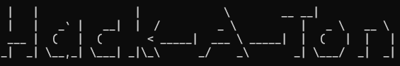
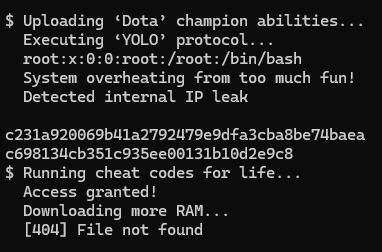

# 🚀 hack-a-ton

A fake terminal "hacking" simulation that fills your screen with random commands and nonsense.  
Use it as an idle animation, to look busy, or just for fun!

---

### 📅 Hackathon 2025
A project for the [boot.dev 2025 Hackathon](https://blog.boot.dev/news/hackathon-2025/)

---

### ⚙️ Usage

1. Clone the repository:  ```git clone https://github.com/voidgiux/hack-a-ton```

2. Enter the directory: ```cd hack-a-ton```

3. Run: ```python3 hack-a-ton.py```
( or with an optional argument: ```python3 hack-a-ton.py --target=something.url```

---

🐍 Python 3 Features Demonstrated
- Modular functions
- File input/output
- Code organization with external modules
- Lists and randomization
- Exception handling with try/except
- Usage of standard libraries: time, random, os, argparse

---

⚠️ Note:
The commands displayed do not perform any real operations — no actual hacking magic here!
They’re inspired by real tools, movies, and games, purely for entertainment.

---
🎲 Randomized output:
The messages are generated randomly, sometimes producing fun combinations.



---


